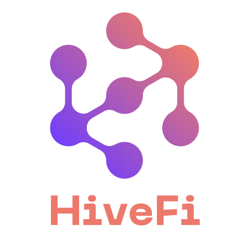
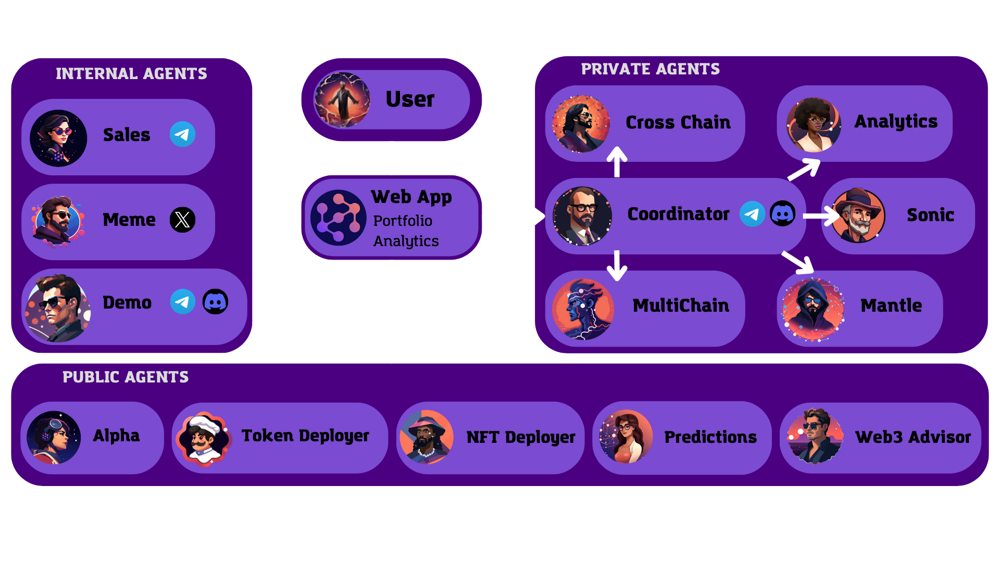
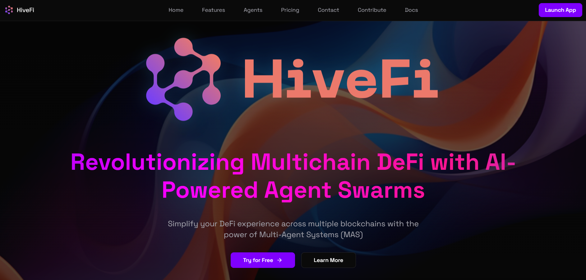

# HiveFi: Multichain DeFAI Agent Swarm

<div align="center">
  
  <h3>Revolutionizing Multichain DeFi with AI-Powered Agent Swarms</h3>
  <p>Simplify your DeFi experience across multiple blockchains with the power of Multi-Agent Systems (MAS)</p>
  <p align="center">
    <a href="https://discord.gg/hivefiai">
      
    </a>
    <a href="https://x.com/hivefi_ai">
      
    </a>
    <a href="https://www.youtube.com/watch?v=demo-video">
      
    </a>
    <a href="https://linktr.ee/hivefi">
      
    </a>
    <a href="https://hivefi.vercel.app/">
      
    </a>
  </p>
</div>

---

## 📚 Table of Contents

- [🌟 Overview](#-overview)
  - [Why Multi-Agent Systems (MAS)?](#why-multi-agent-systems-mas)
- [✨ Features](#-features)
  - [Core Features](#core-features)
  - [Blockchain Features](#blockchain-features)
  - [Web App Features](#-web-app-features)
- [🧰 Tech Stack](#-tech-stack)
- [🤖 Agent Categories](#-agent-categories)
  - [Internal Agents (Platform Operations)](#-internal-agents-platform-operations)
  - [Public Agents (Shared Services)](#-public-agents-shared-services)
  - [Private Agents (Custom Deployments)](#-private-agents-custom-deployments)
- [🏠 Self-Hosting](#-self-hosting)
  - [Requirements for Self-Hosting](#requirements-for-self-hosting)
  - [Support](#support)
- [🚀 Quick Start](#-quick-start)
  - [Prerequisites](#prerequisites)
  - [Installation](#installation)
  - [Configuration](#configuration)
  - [Running the Agent](#running-the-agent)
  - [Running the Web Client](#running-the-web-client)
- [🧪 How to Use](#-how-to-use)
- [🔍 Important Notes](#-important-notes)
- [🛠️ Development](#️-development)
  - [Project Structure](#project-structure)
- [🤝 Contributing](#-contributing)
- [📄 License](#-license)

## 🌟 Overview

HiveFi is an innovative open-source project revolutionizing the DeFi landscape through AI-powered agent swarms. By employing a sophisticated multi-agent system, HiveFi streamlines and automates DeFi operations across multiple blockchains, offering users a seamless and efficient experience. Its modular design ensures scalability and adaptability, empowering users to navigate the complexities of cross-chain DeFi with ease and confidence.

### Why Multi-Agent Systems (MAS)?

Our platform leverages a Multi-Agent System architecture where each agent specializes in specific tasks—from fetching metrics to executing trades—enabling modular, scalable, and efficient operations. This approach ensures:

- **🎯 Specialization**: Optimized performance through task-specific agents
- **📈 Scalability**: Easy addition of new agents and features
- **🛡️ Robustness**: Continued operation even if individual agents fail
- **⚡ Efficiency**: Parallel task execution for improved performance
- **🔄 Adaptability**: Seamless integration with new protocols and chains

<div align="center">
  
  <p><em>HiveFi Architecture</em></p>
</div>

## ✨ Features

### Core Features

- 💬 Natural language processing
- 🤖 Multi-Agent System (MAS): 15 specialized AI agents
- 🔅 Integrated website & web app
- 🛠️ Full-featured Discord, Telegram, and Twitter connectors
- 🔗 Support for multiple LLM providers (OpenAI, Anthropic, etc.)
- 👥 Multi-agent orchestration and coordination
- 📚 Knowledge base with DeFi expertise
- 💾 Retrievable memory and document store
- 💰 Real-time prices using CoinGecko API
- 🚀 Real-time TVL using DefiLlama API
- 📊 Data visualization and analytics
- 🌐 Web browsing capabilities
- 🚀 Highly extensible superplugin architecture

### Blockchain Features

#### Mantle Network
- 💰 Wallet management
- 💸 Token transfers (MNT, USDT, and custom tokens)
- 💱 Token swapping on Merchant Moe
- 💸 Lending on Lendle and Init Capital
- 🌾 Yield farming on Pendle
- 💧 Liquidity provision on Agni Finance

#### Sonic Chain
- 💰 Wallet management
- 💸 Token transfers (S and ESDT tokens)
- 💱 Token swapping on Beets and SwapX
- 💸 Lending on Silo Finance and Aave
- 🌾 Yield farming on Beefy
- 💧 Liquidity provision on Shadow Exchange

#### MultiChain Protocols (Coming Soon)
- 💱 Swaps and Liquidity Provisioning via Uniswap, 1inch, and other Multichain DEXes
- 💸 Lending & Borrowing on Aave and Compound
- 🌾 Multi-chain yield farming on Beefy


#### Cross-Chain Operations
- 🌉 Bridge operations via Wormhole
- 🌉 Bridge operations via DeBridge
- 🌉 Bridge operations via Multichain
- 🔄 Cross-chain asset tracking

### 🖥️ Web App Features
- 🚀 Landing page
- 📄 Agents directory
- 🤖 Chat with agent swarm through web interface
- 👛 Multichain wallet connector
- 📊 Portfolio & analytics dashboard
- 📝 Transaction history
- ⚙️ Settings and preferences

<div align="center">
  
  <p><em>HiveFi Web Interface</em></p>
</div>

## 🧰 Tech Stack

- **Frontend**: React, TypeScript, TailwindCSS, ShadcnUI
- **State Management**: React Context API / Zustand
- **Authentication**: Privy
- **Blockchain Integration**: thirdweb, web3.js/ethers.js
- **Build & Deployment**: Vite, Vercel
- **Agent Framework**: Eliza
- **Workflow Automation**: n8n
- **Package Management**: pnpm

## 🤖 Agent Categories

### 🏢 Internal Agents (Platform Operations)
1. **Meme Agent**: Social media content creation and distribution
2. **Sales Agent**: Customer relations and onboarding
3. **Demo Agent**: Platform demonstration and showcase

### 🌐 Public Agents (Shared Services)
4. **Alpha Agent**: Market opportunity identification
5. **Predictions Agent**: Market forecasting and trend analysis
6. **KOL Agent**: Social media engagement and management
7. **Web3 Advisor Agent**: Technical guidance across chains
8. **Token Deployer Agent**: Token deployment and management
9. **NFT Deployer Agent**: NFT collection deployment

### 🔒 Private Agents (Custom Deployments)
10. **Coordinator Agent**: Multi-agent orchestration and task delegation
11. **Analytics Agent**: Cross-chain data analysis and visualization
12. **Cross Chain Agent**: Cross-chain operations management
13. **Mantle Agent**: Mantle-specific operations
14. **Sonic Agent**: Sonic-specific operations
15. **MultiChain Agent**: Multichain Protocols operations and integrations

## 🏠 Self-Hosting

HiveFi is and will always be open source! We strongly encourage users to self-host their own instance of HiveFi. This gives you full control over your data and agents.

### Requirements for Self-Hosting
- Server or cloud instance (e.g., AWS, DigitalOcean, or your local machine)
- API keys for required services
- Basic knowledge of TypeScript/Node.js for customization

### Support
While self-hosting is a DIY approach, we provide:
- Detailed documentation
- Community support via Discord
- GitHub issues for bug reports
- Basic setup guidance

## 🚀 Quick Start

### Prerequisites

- [Node.js 23+](https://docs.npmjs.com/downloading-and-installing-node-js-and-npm)
- [Git](https://git-scm.com/downloads)
- [pnpm](https://pnpm.io/installation)

> **Note for Windows Users:** [WSL 2](https://learn.microsoft.com/en-us/windows/wsl/install-manual) and [Visual Studio Build Tools](https://visualstudio.microsoft.com/downloads/) are required.

### Installation

```bash
# Clone the repository
git clone https://github.com/hivefi/hivefi
cd hivefi

# Install dependencies
pnpm install

# Copy environment file
cp .env.example .env
```

### Configuration

Edit `.env` file and add your credentials:

```env
# Required for blockchain operations
EVM_PRIVATE_KEY=your_private_key
MANTLE_RPC_URL=https://rpc.mantle.xyz
SONIC_RPC_URL=https://mainnet.sonic.org/rpc

# Choose an API provider and add the API_KEY
OPENAI_API_KEY=                # OpenAI API key
ANTHROPIC_API_KEY=             # For Claude (optional)

# Client Configuration
DISCORD_APPLICATION_ID=        # Discord bot ID
DISCORD_API_TOKEN=             # Discord bot token
TELEGRAM_BOT_TOKEN=            # Telegram bot token
TWITTER_USERNAME=              # Twitter username
TWITTER_PASSWORD=              # Twitter password
TWITTER_EMAIL=                 # Twitter email
```

### Running the Agent

```bash
# Build the project
pnpm build

# Start a single agent (Recommended for testing)
pnpm start --characters="characters/demo-agent.character.json"

# Start demo agents (3)
pnpm start --characters="characters/demo-agent.character.json,characters/alpha-agent.character.json,characters/web3-advisor-agent.character.json"

# Start all agents
pnpm start --characters="characters/meme-agent.character.json,characters/sales-agent.character.json,characters/demo-agent.character.json,characters/alpha-agent.character.json,characters/predictions-agent.character.json,characters/kol-agent.character.json,characters/web3-advisor-agent.character.json,characters/token-deployer-agent.character.json,characters/nft-deployer-agent.character.json,characters/coordinator-agent.character.json,characters/analytics-agent.character.json,characters/cross-chain-agent.character.json,characters/mantle-agent.character.json,characters/sonic-agent.character.json,characters/multichain-agent.character.json"
```

### Running the Web Client

In a new terminal, run the following command:

```bash
cd eliza/client
pnpm run dev
```

## 🧪 How to Use

Interact with the agents using these example prompts:

### Network Information
```
What is Mantle Network?
Tell me about Sonic Chain.
```

### Market Data
```
Get prices for ETH, BTC, MNT, and S
Show me TVL metrics for Mantle and Sonic
What are the top protocols on Mantle by TVL?
```

### Wallet Operations
```
Show me my wallet balances across all chains
Show my portfolio
```

### Token Transfers
```
Send 0.1 MNT to 0x123...
Send 0.01 S to 0x456...
Transfer 0.001 BTC to bc1q...
```

### DeFi Operations
```
Swap 0.1 MNT for USDC on Merchant Moe
Supply 0.1 USDC to Lendle
Borrow 0.01 USDT from Silo Finance
Bridge 0.1 USDC from Mantle to Sonic using Wormhole
```

## 🔍 Important Notes

- Ensure you have sufficient funds for transaction fees
- Always double-check addresses and amounts before executing transactions
- For cross-chain operations, verify that the bridge supports the tokens and chains you're using
- Private keys are stored locally and never transmitted to external servers

## 🛠️ Development

### Project Structure

```
hivefi/
├── assets/                    # Branding assets and images
│   └── logo/                  # Logo files
├── docs/                      # Documentation
│   ├── architecture/          # Architecture diagrams and specs
│   ├── agents/                # Agent specifications
│   └── api/                   # API documentation
├── eliza/                     # Eliza framework integration
│   ├── client/                # Web application
│   │   ├── public/            # Static assets
│   │   └── src/               # Frontend source code
│   ├── packages/
│   │   └── plugin-hivefi/     # Main superplugin
│   │       ├── src/
│   │       │   ├── index.ts   # Agent-specific action selection
│   │       │   ├── analytics/ # Analytics module
│   │       │   │   └── actions/
│   │       │   │       ├── coingecko/
│   │       │   │       ├── defillama/
│   │       │   │       ├── portfolio/
│   │       │   │       ├── geckoterminal/
│   │       │   │       ├── tokenterminal/
│   │       │   │       └── dexscreener/
│   │       │   ├── crosschain/ # Cross-chain module
│   │       │   │   └── actions/
│   │       │   │       ├── wormhole/
│   │       │   │       └── debridge/
│   │       │   ├── mantle/    # Mantle module
│   │       │   │   ├── actions/
│   │       │   │   │   ├── mantle/        # General actions
│   │       │   │   │   ├── merchant-moe/  # DEX
│   │       │   │   │   ├── init-capital/  # Lending
│   │       │   │   │   ├── lendle/        # Lending
│   │       │   │   │   ├── pendle/        # Yield farming
│   │       │   │   │   └── agni/          # Exchange
│   │       │   │   └── providers/
│   │       │   │       └── mantle-wallet.ts
│   │       │   ├── sonic/     # Sonic module
│   │       │   │   ├── actions/
│   │       │   │   │   ├── sonic/         # General actions
│   │       │   │   │   ├── silo-finance/  # Lending
│   │       │   │   │   ├── beets/         # DEX, staking, yield
│   │       │   │   │   ├── swapx/         # DEX
│   │       │   │   │   ├── shadow-exchange/ # DEX
│   │       │   │   │   ├── aave/          # Lending
│   │       │   │   │   ├── beefy/         # Yield farming
│   │       │   │   │   └── uniswap/       # DEX
│   │       │   │   └── providers/
│   │       │   │       └── sonic-wallet.ts
│   │       │   ├── multichain/   # MultiChain module
│   │       │   │   ├── actions/
│   │       │   │   │   ├── aave/          # Cross-chain lending
│   │       │   │   │   ├── uniswap/       # Cross-chain DEX
│   │       │   │   │   ├── beefy/         # Cross-chain yield
│   │       │   │   │   ├── compound/      # Cross-chain lending
│   │       │   │   │   └── aggregators/   # DEX aggregators
│   │       │   │   └── providers/
│   │       │   │       └── multichain-wallet.ts
│   │       │   ├── predictions/ # Predictions module
│   │       │   ├── kol/        # KOL module
│   │       │   ├── alpha/      # Alpha module
│   │       │   ├── nftdeployer/ # NFT Deployer module
│   │       │   ├── tokendeployer/ # Token Deployer module
│   │       │   └── meme/       # Meme module
│   │       ├── templates/      # Response templates
│   │       ├── types/          # TypeScript type definitions
│   │       └── utils/          # Utility functions
│   └── characters/             # Agent character files
├── n8n/                        # n8n workflows
│   ├── coordinator/            # Coordinator agent workflows
│   └── templates/              # Reusable workflow templates
└── README.md                   # Project overview
```

## 🤝 Contributing

1. Fork the repository
2. Create your feature branch (`git checkout -b feature/amazing-feature`)
3. Commit your changes (`git commit -m 'Add some amazing feature'`)
4. Push to the branch (`git push origin feature/amazing-feature`)
5. Open a Pull Request

Please read our [Contributing Guidelines](CONTRIBUTING.md) for more details.

## 📄 License

This project is licensed under the MIT License - see the [LICENSE](LICENSE) file for details.

---

<div align="center">
  <p>Built with ❤️ by the HiveFi team</p>
  <p>
    <a href="https://discord.gg/hivefiai">
      
    </a>
    <a href="https://x.com/hivefi_ai">
      
    </a>
  </p>
</div>
