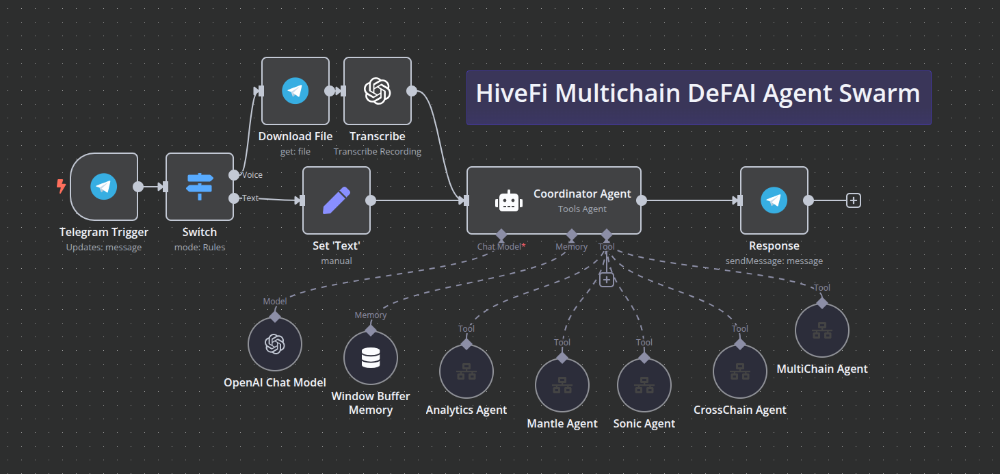
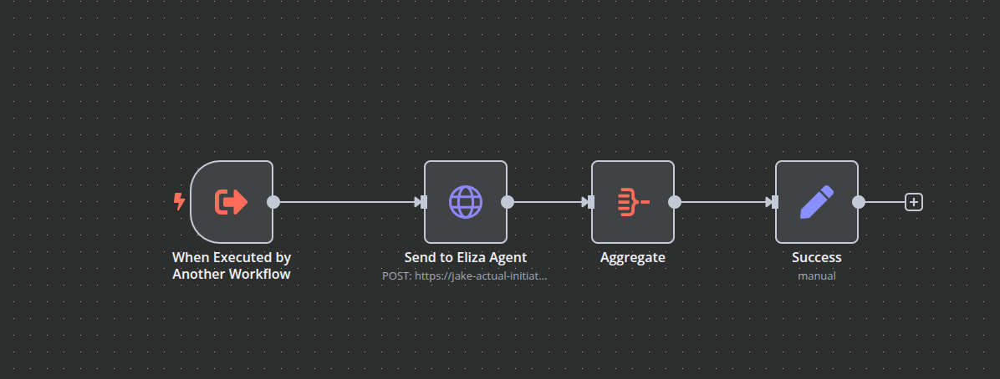

# HiveFi n8n Workflows Guide

Learn how to create, manage, and optimize n8n workflows for HiveFi agents.

## Table of Contents
- [Introduction](#introduction)
- [Getting Started](#getting-started)
- [Workflow Basics](#workflow-basics)
- [Agent Integration](#agent-integration)
- [Advanced Features](#advanced-features)
- [Best Practices](#best-practices)
- [Examples](#examples)

## Introduction

n8n is the workflow automation platform that powers HiveFi's agent coordination and automation capabilities. This guide will help you create efficient and reliable workflows for your HiveFi agents.

### Key Concepts

- **Workflows**: Automated sequences of operations
- **Nodes**: Individual operations within workflows
- **Triggers**: Events that start workflow execution
- **Credentials**: Secure access to external services
- **Expression Mode**: Dynamic data manipulation

## Getting Started

### Prerequisites

- An [n8n](https://n8n.io) account
  - Option 1: Hosted on [n8n.cloud](https://n8n.cloud)
  - Option 2: Self-hosted locally or on a private cloud (Google Cloud, AWS, etc.)

## Available Workflows

### Core Workflows
- `HiveFi_Coordinator_Agent.json` - Main coordinator workflow for agent orchestration
- `HiveFi_Eliza_Agent.json` - Tool definitions for eliza agent interactions
- `HiveFi_Sales_Agent.json` - Tool definitions for sales agent interactions

### Agent Integration Workflows (Same Eliza Agent Tool with different API urls)
-  Anlytics Agent: Analytics and reporting workflow
-  Sonic Agent: Sonic chain operations workflow
-  Mantle Agent: Mantle chain operations workflow
-  Multichain Agent: Multichain protocols operations workflow
-  Crosschain Agent: Cross-chain operations workflow

## Coordinator Agent Architecture

## Eliza Agent Workflow

## Workflow Setup

1. **Import Workflows**
- Open n8n web interface
- Import workflow JSON files
- Configure credentials
- Activate workflows

## Next Steps

1. Explore the [Plugin Development Guide](plugin-guide.md)
2. Join our [Discord](https://discord.gg/hivefiai) #workflow-sharing channel
3. Contribute to our [Workflow Templates](https://github.com/hivefi/workflow-templates)
4. Check out [Self-Hosting Guide](self-hosting.md) for production deployment
