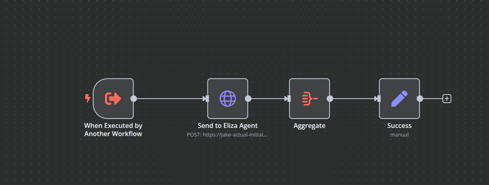

# Multi-Agent System Architecture

## Overview

HiveFi's Multi-Agent System (MAS) is designed to provide intelligent, coordinated automation of DeFi operations across multiple blockchains. This document details the architecture, communication patterns, and coordination mechanisms that enable our agent swarm to work together effectively.

## Agent System Architecture

## Agent Categories

### 1. Internal Agents

Internal agents handle platform operations and are not directly accessible to users.

#### Demo Agent
- **Purpose**: Platform demonstration and education
- **Components**:
  - Interface Layer: User interaction handling
  - Action Executor: Safe operation execution
  - Response Handler: Result formatting
- **Capabilities**: 
  - Execute demo transactions
  - Showcase features
  - Provide tutorials
  - Answer questions

#### Meme Agent
- **Purpose**: Social media content creation
- **Components**:
  - Content Generator
  - Social Media Manager
  - Media Storage
- **Capabilities**:
  - Create memes
  - Generate social posts
  - Manage content distribution

#### Sales Agent
- **Purpose**: Customer relations
- **Components**:
  - Customer Interface
  - Workflow Engine
  - CRM Integration
- **Capabilities**:
  - Handle inquiries
  - Guide onboarding
  - Collect feedback

### 2. Public Agents

Public agents are available through the web app or other clients.

#### Market Analysis Agents
- **Alpha Agent**
  - Market opportunity detection
  - Trend analysis
  - Signal generation
  
- **Predictions Agent**
  - Market forecasting
  - Trend analysis
  - Report generation

#### Community Agents
- **KOL Agent**
  - Social media management
  - Community engagement
  - Content distribution

- **Web3 Advisor**
  - Technical guidance
  - Protocol recommendations
  - Problem resolution

#### Deployment Agents
- **Token Deployer**
  - Token creation
  - Liquidity management
  - Contract deployment

- **NFT Deployer**
  - Collection creation
  - Metadata management
  - Minting operations

### 3. Private Agents

Private agents are available only in custom deployments.

#### Coordinator Agent
- **Purpose**: Task orchestration
- **Components**:
  - Task Router
  - Workflow Engine
  - Agent Manager
- **Capabilities**:
  - Request processing
  - Task delegation
  - Response aggregation

#### Chain-Specific Agents
- **Components**:
  - Network Interface
  - Transaction Manager
  - State Synchronizer
- **Implementations**:
  - Mantle Agent
  - Sonic Agent
  - MultiChain Agent (for protocols deployed across multiple EVM chains)

#### Support Agents
- **Analytics Agent**
  - Data analysis
  - Reporting
  - Visualization

- **Cross Chain Agent**
  - Bridge operations
  - Status tracking
  - Error handling

## Agent Orchestration Workflows (n8n)

### Core Workflows
- `HiveFi_Coordinator_Agent.json` - Main coordinator workflow for agent orchestration
- `HiveFi_Eliza_Agent.json` - Tool definitions for eliza agent interactions
- `HiveFi_Sales_Agent.json` - Tool definitions for sales agent interactions

### Agent Integration Workflows (Same Eliza Agent Tool with different API urls)
-  Anlytics Agent: Analytics and reporting workflow
-  Sonic Agent: Sonic chain operations workflow
-  Mantle Agent: Mantle chain operations workflow
-  Multichain Agent: Multichain protocols operations workflow
-  Crosschain Agent: Cross-chain operations workflow

## Coordinator Agent Architecture

## Eliza Agent Workflow

## Next Steps

For more detailed information about specific components, please refer to:
- [Agents Directory](agents-directory.md) for detailed agent specifications
- [System Overview](system-overview.md) for system architecture
- [Integrations](integrations.md) for protocol integrations
