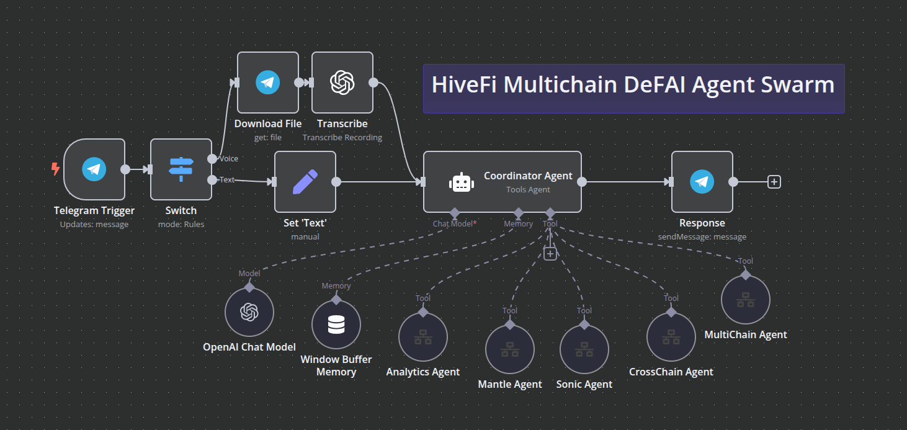

# HiveFi n8n Workflows

This directory contains n8n workflow configurations for the HiveFi Coordinator Agent, which orchestrates operations across five specialized Eliza agents. The workflows are designed to enable efficient multi-agent coordination and complex DeFi operations.

## Available Workflows

### Core Workflows
- `HiveFi_Coordinator_Agent.json` - Main coordinator workflow for agent orchestration
- `HiveFi_Eliza_Agent.json` - Tool definitions for eliza agent interactions
- `HiveFi_Sales_Agent.json` - Tool definitions for sales agent interactions

### Agent Integration Workflows (Same Eliza Agent Tool with different API urls)
-  Anlytics Agent: Analytics and reporting workflow
-  Sonic Agent: Sonic chain operations workflow
-  Mantle Agent: Mantle chain operations workflow
-  Multichain Agent: Multichain protocols operations workflow
-  Crosschain Agent: Cross-chain operations workflow

## Coordinator Agent Architecture

## Eliza Agent Workflow

## Workflow Setup

1. **Import Workflows**
- Open n8n web interface
- Import workflow JSON files
- Configure credentials
- Activate workflows
